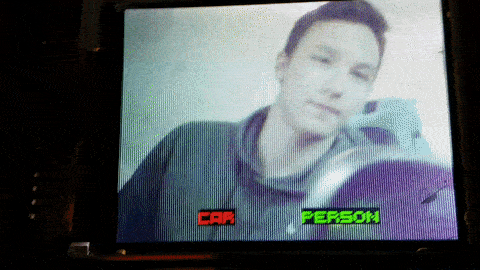

# Person and car detection (MobileNet on microcontrollers)

(TODO introduction and summary, for now check [research/person-car-detection-research.ipynb](research/person-car-detection-research.ipynb) for full app development)
For the C/C++ code check [/application/nucleo-h743-person-car-detection/Core](/application/nucleo-h743-person-car-detection/Core) folder. 

# Demo
Inference time on ARM Cortex-M7: 1195 ms  
(TODO provide an actual good quality demo)  
