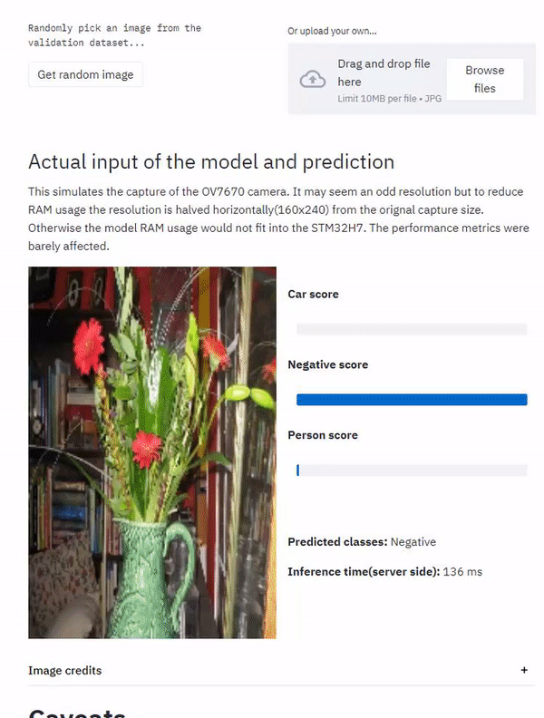

# Person and car detection (MobileNet on microcontrollers)

Image classification is a common task in deep learning. A bit more niche but still very important application is multiclass image classification, where an image may belong to one or more classes. This application aims to provide an example of the development and deployment of this task on constrained devices like microcontrollers using tensorflow lite.

In particular, this application aims to detect whether a person, a car, or both are present in an image. This has interesting applications like improving traffic through traffic lights.

I have chosen to deploy the model on an STM32H743 microcontroller due to its generous specifications like 2MB of flash memory and 1MB of RAM. Inference takes 1195 ms, resulting in 0.83FPS; Which may not seem like much but it is important to remember how cost and power effective microcontrollers are.

Nonetheless, other MCUs like the ESP32 or nRF528 series are also perfectly suitable targets for deployment.

The model weights only 345kB and has a MobileNet feature extractor.

## App development
Check [research/person-car-detection-research.ipynb](research/person-car-detection-research.ipynb) for full app development) 

It may be easier to open the notebook on colab, but keep in mind that if you do so some libraries might have to be installed on the runtime.  

## App deployment
For the C/C++ code check [application/nucleo-h743-person-car-detection/Core](application/nucleo-h743-person-car-detection/Core) folder.

You may find useful [my other repository](https://github.com/PHANzgz/STM32-H7-camera-interface-and-display) where I explain
how to interface an STM32-H7 with the OV7670 camera and the ILI9341 LCD-TFT screen.

(TODO explain a bit each file)

# Web App Demo
(TODO wait for streamlit share invitation)
If you want to try the model right now on your browser you can do it inside the web demo!  

    

# A homemade demo, running on the STM32H743

Inference time on ARM Cortex-M7: 1195 ms  
 
